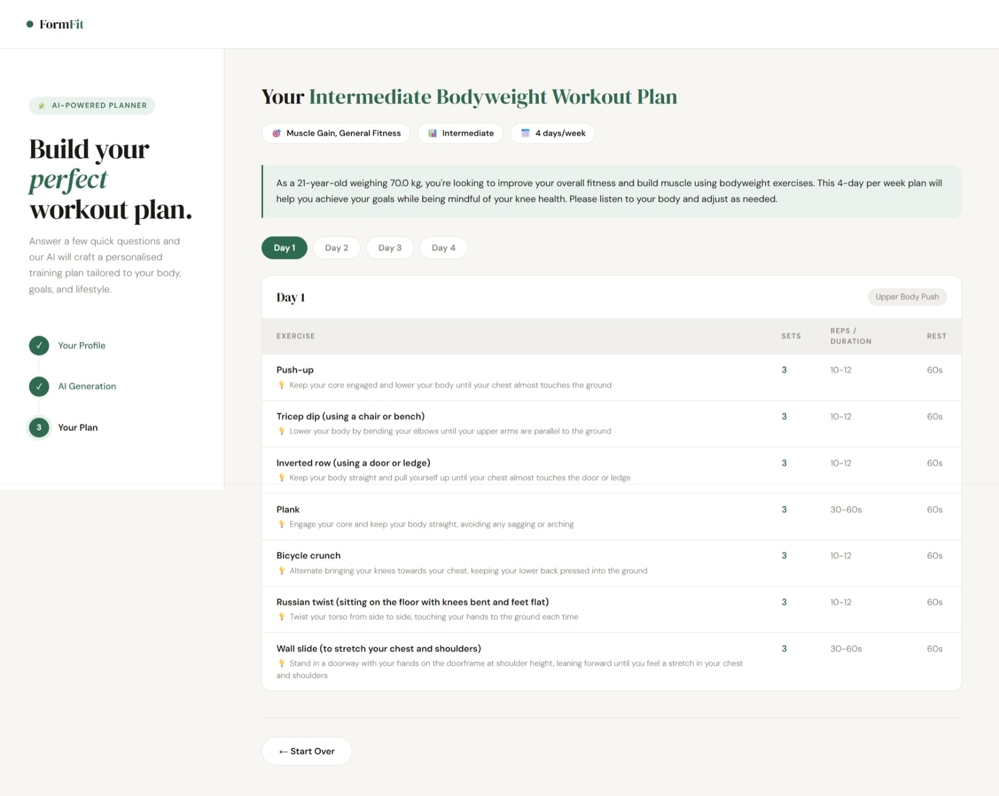

# 🏋️ FormFit — AI-Powered Workout Plan Generator

A full-stack web application that generates personalised workout plans using AI.
Built with **Java Spring Boot** backend and **React** frontend.


---

## 🚀 Tech Stack

| Layer | Technology |
|-------|-----------|
| Backend | Java 21, Spring Boot 3.3 |
| AI | Groq API (LLaMA 3.3 70B) |
| Frontend | React, Vite |
| HTTP Client | Spring WebFlux (WebClient) |
| Build Tool | Maven |

---
## ✨ Features

- 🎯 Select fitness goals (Muscle Gain, Fat Loss, Endurance, etc.)
- 🏟️ Choose available equipment
- 📊 Set fitness level (Beginner / Intermediate / Advanced)
- 📅 Pick days per week
- ⚖️ Input age and weight for personalised intensity
- 🤖 AI generates a full weekly workout schedule
- 💡 Exercise tips, sets, reps, and rest periods included
- 🌿 Rest day recommendations

---

## 🛠️ Project Structure
```
formfit-backend/
├── src/main/java/com/formfit/formfit_backend/
│   ├── config/
│   │   ├── GroqConfig.java        # WebClient setup
│   │   └── WebConfig.java         # CORS + SPA fallback
│   ├── controller/
│   │   └── WorkoutController.java # REST endpoints
│   ├── dto/
│   │   ├── WorkoutRequest.java    # Input from frontend
│   │   ├── WorkoutResponse.java   # Output to frontend
│   │   ├── GroqRequest.java       # Groq API request
│   │   └── GroqResponse.java      # Groq API response
│   └── service/
│       └── GroqService.java       # AI prompt + parsing
├── src/main/resources/
│   └── application.properties
├── frontend/                      # React + Vite app
│   ├── src/
│   │   └── App.jsx
│   └── vite.config.js
└── pom.xml
```

---
## ⚙️ Setup & Running

### Prerequisites
- Java 21
- Node.js 22+
- Maven (included via `mvnw`)
- Groq API key (free at https://console.groq.com)

### 1. Clone the repository
```bash
git clone https://github.com/YOUR_USERNAME/formfit-backend.git
cd formfit-backend
```

### 2. Set your Groq API key

**Windows (PowerShell):**
```powershell
$env:GROQ_API_KEY="gsk_xxxxxxxxxxxxxxxx"
```
**Mac/Linux:**
```bash
export GROQ_API_KEY=gsk_xxxxxxxxxxxxxxxx
```

### 3. Run the backend
```powershell
./mvnw spring-boot:run
```
Backend starts on `http://localhost:8081`

### 4. Run the frontend
```powershell
cd frontend
npm install
npm run dev
```
Frontend starts on `http://localhost:5173`

### 5. Open the app
```
http://localhost:5173
```

---

## 🔌 API Endpoints

| Method | Endpoint | Description |
|--------|----------|-------------|
| POST | `/api/workout/generate` | Generate AI workout plan |
| GET | `/api/workout/health` | Health check |

### Sample Request
```json
POST /api/workout/generate
{
  "goals": ["muscle", "general"],
  "equipment": ["bodyweight"],
  "level": "intermediate",
  "days": 4,
  "age": 21,
  "weight": 70.0,
  "notes": "bad knees"
}
```

### Sample Response
```json
{
  "planTitle": "4-Day Intermediate Bodyweight Plan",
  "intro": "...",
  "weekSchedule": [...],
  "generalTips": [...]
}
```

---
## 📸 Screenshots

> 


---

## 👨‍💻 Author

**Sujal Kalmegh**
